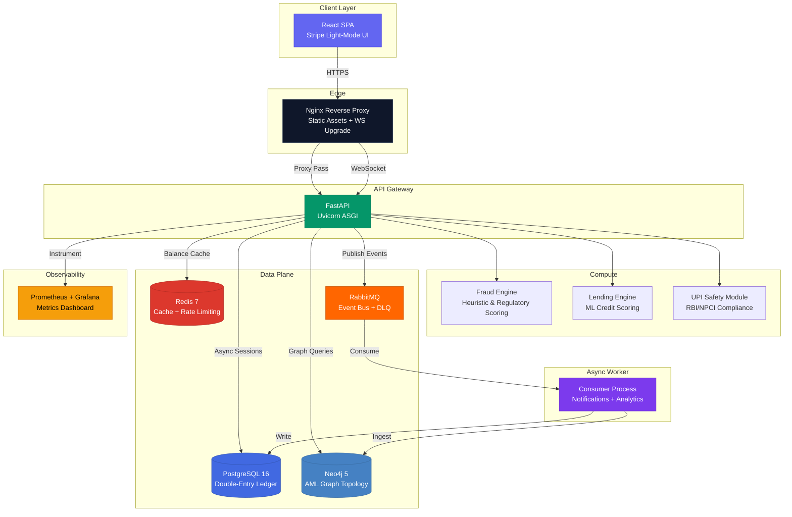

<div align="center">

# SentinelClear

### Enterprise AML & Ledger Infrastructure


**A production-grade ACID-compliant double-entry ledger system with an advanced heuristic risk engine,
Neo4j-powered AML graph topology analysis, and full Indian regulatory compliance (RBI/NPCI/FIU).**

Built for financial institutions that demand cryptographic audit integrity, real-time fraud interception,
and enterprise-grade transaction orchestration — from the first rupee to the last basis point.

---

</div>

## System Architecture



---

## Core Features

### 🔐 Cryptographic Double-Entry Ledger

- **ACID-compliant** atomic fund transfers with `SELECT ... FOR UPDATE` row-level locking
- **Deterministic deadlock prevention** via ascending UUID lock ordering across all account pairs
- **SHA-256 hash-chained audit trail** — every ledger mutation is cryptographically linked to its predecessor, creating a tamper-evident chain verifiable at any point
- **Automated reconciliation engine** — scheduled balance verification recomputes every account from raw ledger entries and flags sub-paisa discrepancies
- **PDF statement generation** — bank-grade ReportLab statements with running balances, summary cards, and audit chain hash footer

### 🧠 Layered Risk Engine

| Strategy | Mechanism | Coverage |
|----------|-----------|----------|
| **Regulatory Blocks** | Indian Banking Mandates | PAN Mandate (§114B), RTGS floor (₹2L), UPI daily cap (₹1L), NPCI velocity (20 txn/day), Beneficiary cooling-off |
| **Heuristic Detection** | Real-time Behavioral Analysis | Split-structuring (smurfing), account drain prediction, burst velocity, time-of-day analysis, recipient concentration, impossible travel detection |

- Real-time composite risk score `[0.0, 1.0]` with configurable review (`≥0.4`) and block (`≥0.7`) thresholds
- **Impossible Travel Detection** — Haversine geospatial velocity analysis flags transactions from physically impossible locations (e.g., Mumbai → Delhi in 2 minutes)
- **Automated FIU STR Generation** — Suspicious Transaction Reports auto-generated as PDF payloads for Financial Intelligence Unit filing

### 🕸️ Neo4j AML Graph Topology

- **Native Cypher traversal** for circular trading detection (`A→B→C→…→A` loops up to depth 6)
- **Connected-component clustering** to identify coordinated fraud rings
- **Force-directed React Flow visualization** — live network graph with risk-colored nodes, animated flagged edges, and transaction volume labels
- **Transfer event ingestion** via async worker — every completed transaction creates `Account` nodes and `TRANSFERRED` edges in real-time

### 🏦 Credit Hub & Maker-Checker

- **ML-powered credit scoring** — Random Forest model evaluating income stability, FOIR, account age, and transaction history to produce CIBIL-equivalent scores
- **RBI-aligned DSCR underwriting** with `VERY_HIGH` / `HIGH` / `MODERATE` / `LOW` risk categories
- **Four Eyes Principle** — high-value corporate transfers (`≥₹10L`) require cryptographic separation of duties: the initiator cannot be the approver
- **Atomic loan disbursement & repayment** — Treasury → User double-entry with hash-chained audit trail

### 🛡️ UPI Safety Framework (RBI/NPCI Mandated)

| Rule | Trigger | Action |
|------|---------|--------|
| **Transaction Pause** | P2P transfer > ₹10,000 to non-whitelisted recipient | 5-minute confirmation window with explicit user consent |
| **Vulnerable Group Protection** | User age ≥70 or disabled, amount > ₹50,000 | Requires designated guardian (trusted person) approval |
| **Emergency Kill Switch** | User-activated panic button | Instant freeze of ALL outgoing payments — requires PIN to deactivate |
| **Annual Receiving Limit** | Inbound credits exceed ₹25,00,000 in a fiscal year | Account frozen pending bank verification |

---

## Tech Stack

### Backend

| Component | Technology | Purpose |
|-----------|-----------|---------|
| **API Framework** | FastAPI 0.115 + Uvicorn | Async ASGI gateway with OpenAPI docs |
| **Primary Database** | PostgreSQL 16 + AsyncPG | Double-entry ledger, accounts, audit logs |
| **Graph Database** | Neo4j 5 | AML network topology & circular trading detection |
| **Cache & Rate Limiting** | Redis 7 + Hiredis | Balance caching, sliding-window rate limiter |
| **Message Broker** | RabbitMQ 3.13 | Durable event bus with DLQ and retry backoff |
| **Authentication** | JWT (HS256) + Firebase SSO | Dual auth: native credentials + Google/GitHub SSO |
| **ML Pipeline** | scikit-learn + pandas | Random Forest credit scoring |
| **PDF Engine** | ReportLab | Bank-grade statements & FIU STR reports |
| **Monitoring** | Prometheus + Grafana | Real-time metrics, dashboards, alerting |
| **Reverse Proxy** | Nginx | TLS termination, static assets, WebSocket upgrade |

### Frontend

| Component | Technology | Purpose |
|-----------|-----------|---------|
| **Framework** | React 18 + Vite | SPA with lazy-loaded routes |
| **Styling** | Tailwind CSS | Stripe-inspired light-mode design system |
| **Charts** | Recharts | Operations dashboard visualizations |
| **Graph Viz** | React Flow | Interactive AML network topology |
| **Auth** | Firebase Auth SDK | Google/GitHub SSO popup flow |
| **HTTP Client** | Axios | Interceptor-based JWT management |

### Infrastructure

| Component | Technology | Purpose |
|-----------|-----------|---------|
| **Containerization** | Docker + Docker Compose | Full-stack orchestration (10 services) |
| **Migrations** | Alembic | Schema version control |
| **Scheduling** | APScheduler | Automated reconciliation jobs |
| **Chaos Engineering** | Docker SDK | Controlled failure injection (kill-db, kill-worker) |

---

## Recent Updates (Stabilization & Parity)

- **Backend Ledger Persistence**: Resolved a cascade of `TypeError` exceptions inside the transfer risk evaluation engine caused by implicit mathematical operations mixing SQLAlchemy `Decimal` instances and raw `float` data types.
- **Audit Ledger Schema Patch**: Hotfixed the `audit_logs` database table and SQLAlchemy ORM by adding the missing `sender_account_id` and `receiver_account_id` properties to support the new dual-entry partitioning strategy.
- **Dashboard Stability**: Applied CSS structural constraints to ensure `Recharts` receives valid parent dimensions, eliminating frontend component crashes due to `width(-1)` evaluation.
- **Exception Masking Fixed**: Corrected a shadowed local `logger` assignment that was swallowing critical transaction exceptions, ensuring accurate error reporting.

---

## Quickstart

```bash
# Clone the repository
git clone https://github.com/sahil8017/SentinelClear.git

# Navigate to project root
cd SentinelClear

# Launch the full stack (10 containers)
docker-compose up -d --build
```

### CI Validation (Local)

```bash
bash scripts/ci-validate.sh
```

```powershell
.\scripts\ci-validate.ps1
```

### Local Access Points

| Service | URL | Credentials |
|---------|-----|-------------|
| **Frontend** | [`http://localhost`](http://localhost) | Register a new account |
| **API Gateway** | [`http://localhost:8000`](http://localhost:8000) | — |
| **API Documentation** | [`http://localhost:8000/docs`](http://localhost:8000/docs) | Interactive Swagger UI |
| **Neo4j Browser** | [`http://localhost:7474`](http://localhost:7474) | `neo4j` / `sentinel_neo4j_2024` |
| **RabbitMQ Management** | [`http://localhost:15672`](http://localhost:15672) | `sentinel` / `sentinel_rabbit_2024` |
| **Grafana Dashboard** | [`http://localhost/grafana`](http://localhost/grafana) | `admin` / `admin` |
| **Prometheus** | [`http://localhost:9090`](http://localhost:9090) | — |

---

## API Surface

The FastAPI gateway exposes **60+ endpoints** across 12 route groups:

| Route Group | Prefix | Key Operations |
|-------------|--------|----------------|
| **Auth** | `/auth` | Register, Login, Firebase SSO, API Keys, Webhooks, Transaction PIN |
| **Accounts** | `/accounts` | Create, Balance, Deposit, Kill Switch, Annual Limit |
| **Transfers** | `/transfers` | Atomic P2P transfers, Pause/Confirm, Guardian Approve/Reject |
| **Maker-Checker** | `/transfers/admin` | Pending queue, Four-Eyes Approve/Reject |
| **Fraud Analytics** | `/fraud` | Dashboard stats, Rule configuration, STR generation |
| **AML Graph** | `/aml` | Network topology, Circular trading detection, Cluster analysis |
| **Loans & Credit** | `/loans` | Credit profiles, ML eligibility, Apply, Approve, EMI repayment |
| **Ledger** | `/ledger` | Entry history, Global integrity verification |
| **Notifications** | `/notifications` | Feed, Unread count, Mark read, Clear |
| **Statements** | `/accounts/{id}/statement` | PDF export with audit hash |
| **Whitelist** | `/whitelist` | Trusted contacts for UPI pause bypass |
| **Admin** | `/admin` | Reconciliation, Chaos hub, Settings |

---

## Project Structure

```
SentinelClear/
├── app/
│   ├── main.py                    # FastAPI application entry point
│   ├── config.py                  # Centralized Pydantic settings
│   ├── database.py                # Async SQLAlchemy engine & session
│   ├── dependencies.py            # JWT auth & API key dependencies
│   ├── models.py                  # SQLAlchemy ORM models (20+ tables)
│   ├── schemas.py                 # Pydantic request/response schemas
│   ├── routers/
│   │   ├── auth.py                # Authentication & Firebase SSO
│   │   ├── accounts.py            # Account management & UPI safety
│   │   ├── transfers.py           # Core transfer engine (1000+ LOC)
│   │   ├── loans.py               # Credit hub & ML underwriting
│   │   ├── fraud.py               # Fraud analytics dashboard
│   │   ├── aml.py                 # AML graph topology queries
│   │   ├── chaos.py               # Chaos engineering endpoints
│   │   ├── notifications.py       # User notification feed
│   │   ├── statement.py           # PDF statement generation
│   │   ├── websocket.py           # Real-time fraud alert stream
│   │   └── whitelist.py           # Trusted contact management
│   ├── services/
│   │   ├── fraud_service.py       # 3-layer risk orchestrator
│   │   ├── fraud_rules.py         # 7 individual fraud detection rules
│   │   ├── fraud/                 # ML scoring engine + model
│   │   ├── ledger.py              # Double-entry ledger service
│   │   ├── audit.py               # SHA-256 hash-chained audit log
│   │   ├── loan_service.py        # Atomic loan disbursement/repayment
│   │   ├── neo4j_service.py       # Graph DB ingestion & Cypher queries
│   │   ├── cache.py               # Redis balance caching
│   │   ├── rabbitmq.py            # Event publisher with DLQ
│   │   ├── rate_limit.py          # Sliding-window rate limiter
│   │   ├── upi_safety.py          # RBI/NPCI safety rule engine
│   │   ├── geo.py                 # Impossible travel detection
│   │   ├── reconciliation.py      # Automated balance verification
│   │   └── idempotency.py         # Duplicate transaction prevention
│   └── ml/
│       ├── model/                 # Trained Random Forest artifacts
│       └── train_loan_model.py    # Model training pipeline
├── worker/
│   └── consumer.py                # Async RabbitMQ consumer + Neo4j ingestion
├── frontend/
│   └── src/                       # React 18 SPA (Stripe design system)
├── nginx/
│   └── nginx.conf                 # Reverse proxy + WebSocket upgrade
├── monitoring/
│   └── prometheus.yml             # Scrape configuration
├── alembic/                       # Database migration scripts
├── tests/                         # pytest + pytest-asyncio test suite
├── docker-compose.yml             # Full-stack orchestration (10 services)
├── Dockerfile                     # Multi-stage Python build
└── requirements.txt               # Pinned Python dependencies
```

---

## Security Model

| Layer | Mechanism |
|-------|-----------|
| **Authentication** | JWT (HS256) with configurable expiry + Firebase SSO (Google/GitHub) |
| **Authorization** | Role-based (`USER` / `ADMIN`) with DB-verified admin checks |
| **Step-Up Auth** | bcrypt-hashed transaction PIN required for fund transfers |
| **API Keys** | SHA-256 hashed keys with prefix-based lookup (never stored raw) |
| **Rate Limiting** | Redis-backed sliding window per IP (login) and per user (transfers) |
| **Idempotency** | 24-hour TTL idempotency keys prevent duplicate transaction processing |
| **CORS** | Explicit origin whitelist with restricted methods and headers |
| **Webhook Signing** | HMAC-SHA256 payload signatures for outbound webhook delivery |
| **Audit Integrity** | SHA-256 hash chain — every entry links to its predecessor |

---

## Compliance Coverage

| Regulation | Implementation |
|-----------|----------------|
| **RBI KYC** | PAN mandate enforcement for transactions ≥ ₹50,000 (Section 114B) |
| **NPCI UPI Limits** | Daily volume cap (₹1,00,000), velocity cap (20 txn/day), RTGS floor (₹2,00,000) |
| **PMLA 2002** | Suspicious Transaction Report (STR) auto-generation for FIU filing |
| **RBI Circular 2024** | UPI Safety Framework: transaction pause, vulnerable group, kill switch, annual limits |
| **Four Eyes Principle** | Cryptographic separation of duties for high-value approvals |
| **AML/CFT** | Neo4j-powered circular trading detection and network cluster analysis |

---

## License

This project is licensed under the **MIT License** — see the [LICENSE](LICENSE) file for details.

---

<div align="center">

**Built with precision for financial infrastructure that doesn't break.**

*SentinelClear — Where every rupee is accounted for.*

</div>
